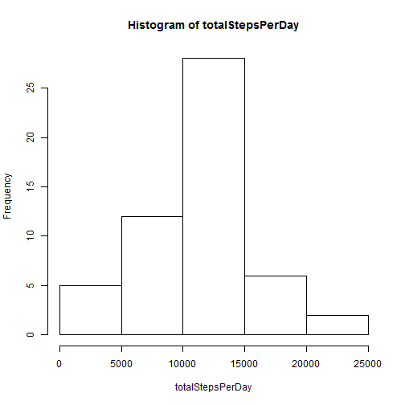
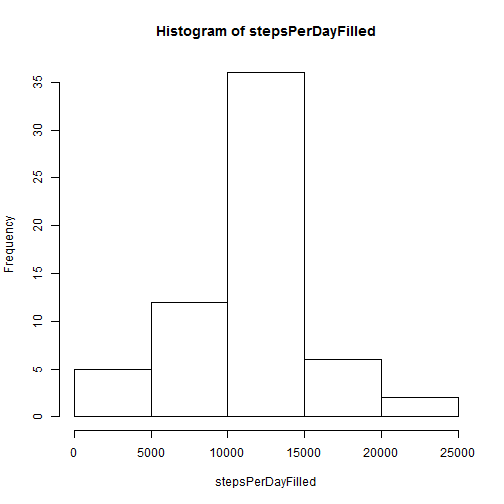
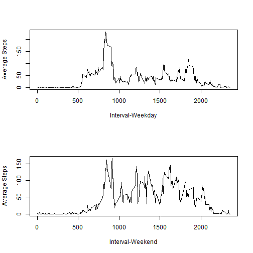

## Loading and preprocessing the data
Read data from zip file directly into data.frame. Assume the zipped data file is in working directory. 


```r
data <- read.csv(unz("activity.zip", "activity.csv"), sep=",", na.strings="NA", stringsAsFactors=FALSE)
```

Filter out rows containing 'NA'


```r
filteredData <- na.omit(data)
```

## What is mean total number of steps taken per day?

**Make a histogram of the total number of steps taken each day**
Use tapply to get total number of steps taken per day. Then call the function hist to draw the histogram


```r
totalStepsPerDay <- tapply(filteredData$steps, INDEX=list(filteredData$date), FUN=sum)
hist(totalStepsPerDay)
```

 

**Calculate and report the mean and median total number of steps taken per day**
1. Mean 

```r
meanVal <- mean(totalStepsPerDay)
```
The mean is **1.0766189 &times; 10<sup>4</sup>**.

2. Median

```r
medianVal <- median(totalStepsPerDay)
```
The median is **10765**.

## What is the average daily activity pattern?

**Make a time series plot (i.e. type = "l") of the 5-minute interval (x-axis) and the average number of steps taken, averaged across all days (y-axis)**

```r
avgStepsPerInterval <- tapply(filteredData$steps, INDEX=list(filteredData$interval), FUN=mean)
plot(names(avgStepsPerInterval), avgStepsPerInterval, type="l", xlab="Interval", ylab="Average Steps")
```

 


**Which 5-minute interval, on average across all the days in the dataset, contains the maximum number of steps?**

```r
maxInterval <- names(which.max(avgStepsPerInterval))
```

The interval **835** contains the maximum number of steps.

## Imputing missing values

**Calculate and report the total number of missing values in the dataset (i.e. the total number of rows with NAs)**

```r
naRowCount <- nrow(data) - nrow(filteredData)
```
The total number of missing values in the data is **2304**.

**Devise a strategy for filling in all of the missing values in the dataset. The strategy does not need to be sophisticated. For example, you could use the mean/median for that day, or the mean for that 5-minute interval, etc.**
I use the mean for that 5-minute interval to fill missing values. 

**Create a new dataset that is equal to the original dataset but with the missing data filled in.**

```r
filledData <- data
filledData$steps[is.na(filledData$steps)] <- ave(filledData$steps, filledData$interval, FUN=function(x) mean(x, na.rm=TRUE))[c(which(is.na(filledData$steps)))]
```

**Make a histogram of the total number of steps taken each day and Calculate and report the mean and median total number of steps taken per day. Do these values differ from the estimates from the first part of the assignment? What is the impact of imputing missing data on the estimates of the total daily number of steps?**


```r
stepsPerDayFilled <- tapply(filledData$steps, INDEX=list(filledData$date), FUN=sum)
hist(stepsPerDayFilled)
```

 
1. Mean after filled

```r
meanValFilled <- mean(stepsPerDayFilled)
```
The mean is **1.0766189 &times; 10<sup>4</sup>**.

2. Median after filled

```r
medianValFilled <- median(stepsPerDayFilled)
```
The median is **1.0766189 &times; 10<sup>4</sup>**.

Mean value is same as the first part of the assignment (ignore NA). Median is same as mean now which is different compared to before. Also, the number of days which total daily number of steps is between 10000 and 15000 increases. This is because some days having 'NA' total daily number of steps bef6ore. After filling missing values, daily number of steps for these days become the mean total number of steps (**10765**) which is between 10000 and 15000.

## Are there differences in activity patterns between weekdays and weekends?
**Create a new factor variable in the dataset with two levels - "weekday" and "weekend" indicating whether a given date is a weekday or weekend day.**

```r
filledData$weekDayOrNot <- ifelse(!weekdays(as.Date(filledData$date)) %in% c("Saturday", "Sunday"), "weekday", "weekend")
```

**Make a panel plot containing a time series plot (i.e. type = "l") of the 5-minute interval (x-axis) and the average number of steps taken, averaged across all weekday days or weekend days (y-axis).**

```r
par(mfrow=c(2,1))
weekdayData <- subset(filledData, filledData$weekDayOrNot == "weekday")
weekendData <- subset(filledData, filledData$weekDayOrNot == "weekend")
avgStepsPerIntervalWeekday <- tapply(weekdayData$steps, INDEX=list(weekdayData$interval), FUN=mean)
avgStepsPerIntervalWeekend <- tapply(weekendData$steps, INDEX=list(weekendData$interval), FUN=mean)
plot(names(avgStepsPerIntervalWeekday), avgStepsPerIntervalWeekday, type="l", xlab="Interval-Weekday", ylab="Average Steps")
plot(names(avgStepsPerIntervalWeekend), avgStepsPerIntervalWeekend, type="l", xlab="Interval-Weekend", ylab="Average Steps") 
```

 
